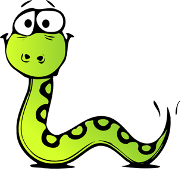
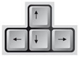
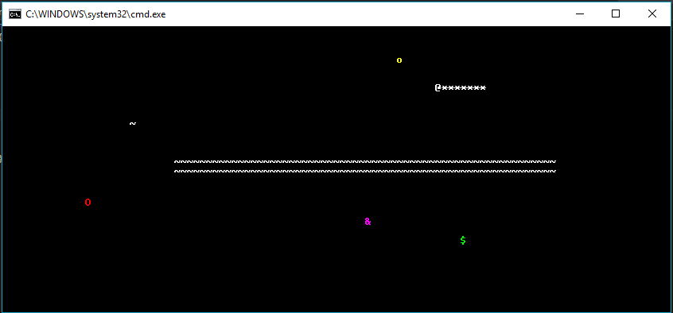
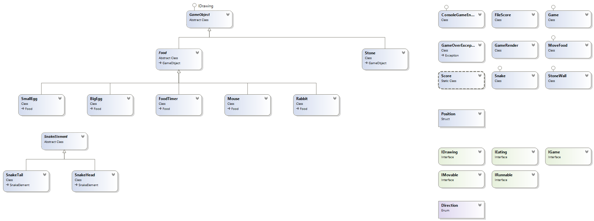

# Team "Tequila Sunrise", teamwork project - "Snake"
# Object-oriented Programming course - December, 2016
----------------------------------

##Team members:

 1. Genoveva Ivanova - geiff
 2. Tsvetelina Marinova - tsvety_m
 3. Yanko Nikolov - yanko.nikolov
 4. Evgeni Trifonov - Sannin
 5. Encho Enevski - encho.enevski
 6. Todi111 - Todor Grigorov
 7. Angel1985 - Angel Yazarov

##GitHub repository
https://github.com/encho253/OOP-Team-Work-2016

##Telerik Academy Showcase System place
http://best.telerikacademy.com/

##Project description
This project is a simple implementation of the popular game "Snake".

The game is operated through arrow keys and is a single-player game.

There are 4 types of food :
- Small egg, yellow symbol – "o“ – gives 100 points
- Big egg, red symbol – “O” – gives 150 points
- Mouse, purple symbol - "&" – gives 200 points
- Rabbit, green symbol - "$" – gives 250 points

The big and the small eggs appear in random positions and disappear after 8 seconds, only to reappear at another place. The rabbit and the mouse are moving constantly and disappear only when eaten.

The snake grows in length when it eats any of these foods and points are added to the score depending on the food that it has eaten.

There are two types of obstacles – stone and stone wall. The snake dies under two conditions – if it either hits an obstacle or if it hits itself. Upon death, the final score is written in the console and it is a sum of all the scores collected by eating food.

The food has constant count of 4. After any type of food is eaten, the game will spawn additional food of the same type.

The food cannot appear on a stone or stone wall.

The head of the snake is represented by the symbol “@”,  and the body contains only “ * ” symbols.

There is an event created – when 100 points are reached a stone wall is placed at the center of the screen.

##Class diagram

